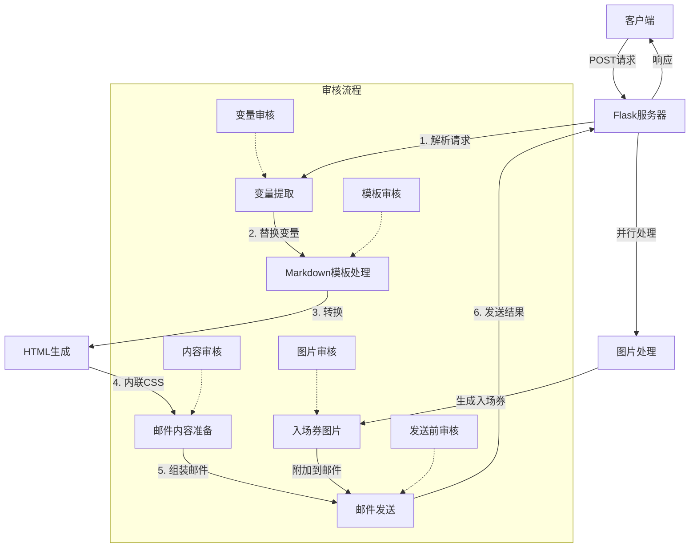

# Markdown to Mail 服务

这是一个将Markdown文档转换为HTML邮件并发送的服务，支持模板变量替换、图片处理和邮件发送功能。

## 系统流程

整个系统的工作流程如下图所示：



### 流程说明

1. **请求接收**：Flask服务器接收客户端的POST请求，包含邮件接收者和所需变量
2. **变量提取**：从请求中提取变量，并进行格式转换（如日期格式化）
3. **模板处理**：读取Markdown模板，并替换其中的变量占位符
4. **HTML转换**：将Markdown转换为HTML，并应用内联CSS样式
5. **图片处理**：根据提供的信息生成个性化入场券图片
6. **邮件发送**：组装HTML邮件、纯文本版本和附件，通过SMTP发送
7. **结果返回**：向客户端返回处理结果和详细状态信息

## 配置文件

系统使用以下配置文件：

### config.py

包含所有系统配置，分为以下几个部分：

- **SMTP配置**：邮件服务器设置，包括服务器地址、用户名、密码和端口
- **邮件配置**：邮件主题、默认附件和模板路径
- **图片配置**：入场券模板路径、输出目录和字体设置
- **日期格式**：定义不同场景下的日期格式

## 安装指南

### 环境要求

- Python 3.6+
- pip 包管理器

### 依赖安装

```bash
pip install -r requirements.txt
```

需要安装的主要依赖包：

- **Flask**：Web服务框架
- **pypandoc**：Markdown转HTML转换工具（需要先安装pandoc）
- **premailer**：CSS内联工具
- **Pillow**：图片处理库
- **pytz**：时区处理

### pandoc安装

在使用前，需要先安装pandoc：

- **macOS**：`brew install pandoc`
- **Windows**：从[pandoc官网](https://pandoc.org/installing.html)下载安装包
- **Linux**：`apt-get install pandoc` 或 `yum install pandoc`

## 使用方法

### 启动服务

```bash
python main.py
```

服务将在 `0.0.0.0:5001` 上启动。

### API调用

向 `/send_email` 端点发送POST请求，JSON格式如下：

```json
{
  "mail_recipient": "recipient@example.com",
  "spaceone_name": "姓名",
  "spaceone_phase": "五",
  "spaceone_paragraph": "自定义段落",
  "spaceone_offerings": "服务内容",
  "spaceone_cost": "费用",
  "spaceone_member_start": "2025/05/01",
  "spaceone_membership_end": "2026/05/01"
}
```

### 响应格式

```json
{
  "success": true,
  "message": "邮件发送成功!",
  "step_status": {
    "获取信息": "成功",
    "检查 mail_recipient": "成功",
    "生成变量": "成功",
    "读取邮件模板": "成功",
    "模板替换": "成功",
    "Markdown 转 HTML": "成功",
    "内联 CSS": "成功",
    "附件检查": "成功",
    "邮件发送": "成功"
  }
}
```

## 目录结构

```
.
├── main.py              # 主程序入口
├── requirements.txt     # 依赖列表
├── resources/          # 资源文件
│   ├── fonts/          # 字体文件
│   └── images/         # 图片资源
├── src/                # 源代码
│   ├── config.py       # 配置文件
│   ├── email_handler.py # 邮件处理模块
│   └── picture.py      # 图片处理模块
└── templates/          # 邮件模板
    └── 邮件内容.md      # Markdown邮件模板
```